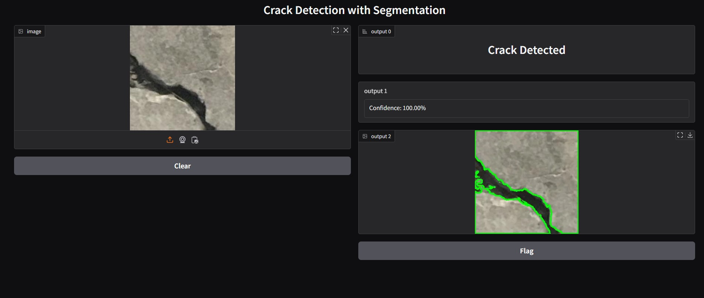

## Surface Crack Detection Model using InceptionV3
>Final UI of the project


## 🚀 Installation

```bash
git clone https://github.com/Samarth2190/Surface-Fissure-Detection-using-Inception-V3.git
cd Surface-Fissure-Detection-using-Inception-V3
pip install -r requirements.txt
```
